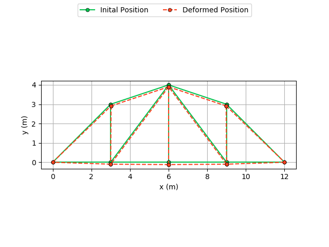

# Truss2D

This code implements a Finite Element Method for discretization and solution of two-dimensional truss problems. The governing equations are discretized within the FEM and the resulting linear system of equations is solved with a LU Factorization found in PETSc suite.

## Dependencies

To use, it is necessary

- [python 3](https://www.python.org/downloads/);
- [matplotlib](https://pypi.org/project/matplotlib/);
- [numpy](https://pypi.org/project/numpy/);
- [petsc](https://www.mcs.anl.gov/petsc/index.html).

## Input

There are five \*.txt files for inputting the nodes, elements connectivity, boundary conditions and properties.

### Elements Connectivity (connectivity.txt)

The elements connectivity is written as:
```shell
first_node_1 second_node_1 # first_element
first_node_2 second_node_2 # second_element
...
```

### Coordinates (coordinates.txt)

The nodes coordinates (in meters) are listed as:
```shell
x_position_1 y_position_1 # first_node
x_position_2 y_position_2 # second_node
...
```

### Dirichlet Boundary Conditions (dirichletBC.txt)

The Dirichlet boundary conditions are given by "node_number direction value", in which direction is 1 for "x" and 2 for "y" and the value should be in meters:
```shell
node_number direction value # 1 for x-direction and 2 for y-direction
...
```

### Neumann Boundary Conditions (neumannBC.txt)

The Neumann boundary conditions are also given  by "node_number direction value", in which direction is 1 for "x" and 2 for "y" and the value should be in N:
```shell
node_number direction value # 1 for x-direction and 2 for y-direction
...
```

### Properties (properties.txt)

The input properties are the Young's modulus and the section area, the former in Pa and the latter in m²:
```shell
value_1 # Young's modulus, in Pa
value_2 # Section area, in m2
```

## Run

To run this code, first edit the "CMakeLists.txt" file with the location of PETsc installation. Set the problem with the input files and call the "truss.sh" script.

## Results

The results are exported to \*.txt files in the export folder and plotted to \*.png files in the plot folder.

### Displacement

The displacement field obtained by the solution of the linear system of equations is exported to the trussSolution.txt file as:
```shell
u_displacement_1 # Displacement (in meters) in x-direction for node 1
v_displacement_1 # Displacement (in meters) in y-direction for node 1
u_displacement_2 # Displacement (in meters) in x-direction for node 2
v_displacement_2 # Displacement (in meters) in y-direction for node 2
...
```

The nodes position is plotted in initial configuration and deformed configuration. This results are found in the trussDeformed.png file.

<p float="left">
	
</p>

### Reaction Forces

The reaction forces obtained by the solution of the truss problem is exported to the trussReactions.txt file as:
```shell
reaction_in_x_1 # Reaction force (in N) in x-direction for node 1
reaction_in_y_1 # Reaction force (in N) in y-direction for node 1
reaction_in_x_2 # Reaction force (in N) in x-direction for node 2
reaction_in_y_2 # Reaction force (in N) in y-direction for node 2
...
```

The applied and reaction forces in the truss are depicted in the trussForces.png file.

<p float="left">
	
</p>